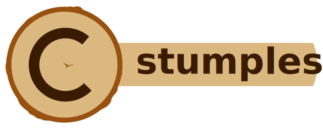

**Une bibliothèque de journalisation C conçue pour des performances élevées et un ensemble de fonctionnalités riche.**

[](https://github.com/goatshriek/stumpless/actions/workflows/linux.yml)
[](https://github.com/goatshriek/stumpless/actions/workflows/windows.yml)
[](https://github.com/goatshriek/stumpless/actions/workflows/mac.yml)
[](https://codecov.io/gh/goatshriek/stumpless)
[](https://sonarcloud.io/dashboard?id=stumpless)
[](https://gitter.im/stumpless/community?utm_source=badge&utm_medium=badge&utm_campaign=pr-badge)
[](https://opensource.org/licenses/Apache-2.0)
[](https://github.com/goatshriek/stumpless/blob/latest/docs/CODE_OF_CONDUCT.md)


[English](../../README.md) | [Français](./README.md) | [한국어](../ko-kr/README.md) | [简体中文](../zh-cn/自述.md)


[Principales fonctionnalités](#principales-fonctionnalités) |
[Compilation et installation rapides](#compilation-et-installation-rapides) |
[Utilisation de base](#utilisation-de-base) |
[Contribuer](#contribuer)


## Principales fonctionnalités
Stumpless possède de nombreuses fonctionnalités qui rendent la journalisation en C rapide et facile :
 * journalisation vers [de nombreux supports](#vers-quoi-peut-il-journaliser) comme Splunk, rsyslog,
   journald, le journal d'événements Windows, sqlite, et plus encore !
 * journalisation structurée et non structurée selon vos besoins
 * compilable sur Linux, Windows, Mac, FreeBSD, MinGW, MSYS2, Cygwin, DOS, et plus !
 * thread-safe
 * peut être ajusté ou supprimé lors de la compilation pour un coût nul à l'exécution
 * localisé dans plusieurs langues 🇦🇱 🇧🇷 🇧🇬 🇨🇳 🇨🇿 🇩🇪 🇩🇰 🇪🇸 🇫🇷 🇬🇷 🇭🇺 🇮🇳 🇮🇱 🇮🇹
   🇯🇵 🇰🇪 🇰🇷 🇵🇱 🇸🇰 🇱🇰 🇸🇪 🇹🇷 🇺🇸
   ([ajoutez la vôtre !](https://github.com/goatshriek/stumpless/blob/latest/docs/localization.md))
 * documentation
   [facile d'accès](https://goatshriek.github.io/stumpless/docs/c/latest/),
   [exemples](https://github.com/goatshriek/stumpless/tree/latest/docs/examples),
   et [support](https://gitter.im/stumpless/community).


### Vers quoi peut-il journaliser ?
Un objectif principal de cette bibliothèque est de fournir une interface de journalisation cohérente vers
une grande variété de cibles de journalisation. Cela signifie que vous pouvez vous concentrer sur la définition des événements
et où vous souhaitez les envoyer, sans avoir à trouver d'autres SDK ou à ajouter des démons
et des plugins pour les acheminer où vous le souhaitez. Stumpless peut écrire des logs vers :
 * Buffers de caractères simples
 * Fichiers et flux
 * Sockets Unix (comme un démon syslog local)
 * Serveurs réseau (IPv4 ou IPv6, TCP ou UDP)
 * Service Systemd Journald
 * Bases de données Sqlite3
 * Journal d'événements Windows
 * Fonctions personnalisées, pour tout autre besoin !

Vous ne trouvez pas ce dont vous avez besoin ? Créez une
[issue](https://github.com/goatshriek/stumpless/issues/new?template=feature_request.md)
avec votre demande et nous l'ajouterons à notre
[feuille de route](https://github.com/goatshriek/stumpless/blob/latest/docs/roadmap.md) !


## Compilation et installation rapides
Stumpless ne nécessite que cmake et une chaîne d'outils compatible cmake (comme GCC
ou Visual Studio) pour être compilé.

```sh
# cloner la dernière version du dépôt source
git clone git@github.com:goatshriek/stumpless.git

# créer un nouveau dossier de compilation
mkdir build
cd build

# configurer la nouvelle compilation
cmake ../stumpless

# compiler stumpless (avec 4 threads - ajustez selon vos besoins)
cmake --build . --parallel 4

# installer la bibliothèque (vous aurez probablement besoin de sudo)
sudo cmake --install .
```

Consultez les [instructions d'installation](INSTALL.md) pour plus de détails sur
la compilation et l'installation de stumpless dans différents environnements et/ou avec d'autres
chaînes d'outils.


## Utilisation de base
La façon la plus simple de commencer est d'utiliser la fonction `stumplog` comme un remplacement direct
de la fonction `syslog` de la bibliothèque standard :

```c
// si vous faisiez ceci :
syslog( LOG_INFO | LOG_USER, "Mon message #%d", count );

// alors vous pouvez commencer par changer pour ceci :
stumplog( LOG_INFO | LOG_USER, "Mon message #%d", count );
```

Si vous n'avez pas ouvert de cible, cela journalisera les messages vers la cible par défaut de
la plateforme : sous Linux c'est `/dev/log`, sur un système Mac ce sera
`/var/run/syslog`, et sur une machine Windows c'est le journal d'événements Windows. Si vous
ouvrez une ou plusieurs cibles avant d'appeler `stumplog`, alors les logs seront envoyés à
la cible la plus récemment ouverte.

Si vous souhaitez un appel de fonction encore plus court, vous pouvez utiliser la fonction `stump`
pour envoyer un message à la cible courante. Vous pouvez également utiliser des spécificateurs de format comme
avec `printf` :

```c
stump( "Échec de tentative de connexion #%d pour l'utilisateur %s", count, username );
```

Si vous n'avez pas besoin de spécificateurs de format, utilisez l'une des variantes `_str` :
c'est à la fois plus rapide et plus sûr !

```c
stump_str( "Échec de connexion ! Voir les données structurées pour plus d'infos." );
```

Si vous souhaitez ouvrir une cible spécifique plutôt que d'utiliser la valeur par défaut, ouvrez simplement
celle dont vous avez besoin et commencez à envoyer des messages. Par exemple, pour journaliser dans
un fichier nommé `example.log` :

```c
target = stumpless_open_file_target( "example.log" );

// utilise la dernière cible ouverte par défaut
stump( "Échec de tentative de connexion #%d pour l'utilisateur %s", count, username );
```

Envoyer des messages sur le réseau vers quelque chose comme Splunk ou rsyslog est tout aussi
simple :

```c
target = stumpless_open_udp4_target( "send-to-splunk-example",
                                     "mylogserver.com" ); // ou utilisez une IP
stump( "Échec de tentative de connexion #%d pour l'utilisateur %s", count, username );
```

Si vous avez plusieurs cibles, vous pouvez envoyer des messages à une cible choisie comme
ceci :

```c
stumpless_add_message( target,
                       "Échec de tentative de connexion #%d pour l'utilisateur %s",
                       count,
                       username );
```


### Raccourcis de sévérité
Il est courant de spécifier les niveaux de sévérité directement dans les appels de journalisation, donc stumpless
fournit quelques macros pour rendre cela moins verbeux et plus efficace. Par
exemple, pour journaliser des messages avec une sévérité INFO, vous pouvez faire ceci :

```c
stump_i( "ceci est journalisé comme un message info" );
```

Et si vous souhaitez également voir les informations sur le fichier source, le numéro de ligne et le nom de la fonction dans
chaque message, vous pouvez utiliser `_t` (le 't' est pour trace) :

```c
stump_t( "cela inclut les infos de source" );
```

Utiliser ces fonctions a l'avantage supplémentaire qu'elles peuvent être supprimées à
la compilation en définissant simplement les symboles `STUMPLESS_ENABLE_UPTO` ou
`STUMPLESS_DISABLE_DOWNTO`. Cela facilite le changement de niveaux de journalisation
entre les builds, par exemple pour avoir des versions prod et debug sans différences
dans leur code source.

```c
// assurez-vous de définir ceci avant d'inclure stumpless.h
#define STUMPLESS_ENABLE_UPTO_INFO

// ...

// ce log passera sans problème
stump_i( "Je fais ce que tu as demandé" );

// ce message de debug est complètement supprimé : aucun impact à l'exécution
stump_d( "INFO DEBUG : %d, %d, %s", thing_1, thing_2, stringy_thingy );
```

Consultez les en-têtes dans
[stumpless/level](https://github.com/goatshriek/stumpless/tree/latest/include/stumpless/level)
pour voir la liste complète des fonctions raccourcies de sévérité, ou l'
[exemple de niveau de sévérité](https://github.com/goatshriek/stumpless/tree/latest/docs/examples/severity_level)
pour voir un programme complet en action.


### Encore plus d'exemples
Pour des exemples plus détaillés des scénarios ci-dessus, l'utilisation de types de cibles spécifiques,
comment gérer des structures de messages plus complexes, et plus encore, consultez les
[exemples](https://github.com/goatshriek/stumpless/tree/latest/docs/examples). Ceux-ci incluent des fichiers de code annotés à compiler,
exécuter et modifier pour vous lancer.


## Contribuer
Vous remarquez un problème ou avez une demande de fonctionnalité ? Créez simplement une issue en utilisant l'un des
modèles, et nous répondrons aussi vite que possible. Vous pouvez également consulter les
[directives de contribution](docs/CONTRIBUTING.md) du projet pour plus de détails
sur les différentes façons de contribuer à la communauté open source !

Si vous souhaitez réellement écrire du code ou faire une mise à jour vous-même, jetez un œil
au [guide de développement](docs/development.md) pour une orientation détaillée.
Il existe plusieurs options selon votre niveau d'expérience et votre familiarité avec
les contributions.

La première option est de parcourir la liste des issues marquées avec le label
[good first issue](https://github.com/goatshriek/stumpless/issues?q=is%3Aissue+is%3Aopen+label%3A%22good+first+issue%22).
Ces issues sont sélectionnées pour être une petite quantité de travail mais significative, et
incluent des détails sur l'approche générale à adopter pour les compléter. Elles
sont un excellent point de départ si vous souhaitez simplement tester ce projet ou la contribution open source en général.

Les développeurs plus expérimentés préféreront peut-être consulter la liste complète des issues du
projet, ainsi que la
[feuille de route](https://github.com/goatshriek/stumpless/blob/latest/docs/roadmap.md).
Si un élément vous intéresse, laissez un commentaire dans l'issue existante ou ouvrez-en
une nouvelle si elle n'existe pas encore et indiquez votre intention de travailler dessus afin que
d'autres sachent qu'elle est en cours.


## Documentation et communauté
Si vous êtes curieux de savoir comment fonctionne quelque chose dans stumpless qui n'est pas expliqué
ici, vous pouvez consulter la section appropriée de la documentation, stockée dans le
[dossier docs](https://github.com/goatshriek/stumpless/blob/latest/docs/).
Les dossiers du dépôt contiennent leurs propres fichiers README détaillant leur contenu et toute autre information pertinente. La documentation de chaque fonction
est également hébergée sur le
[site du projet](https://goatshriek.github.io/stumpless/), pour la bibliothèque C
ainsi que pour les autres liaisons de langage comme C++.

Stumpless inclut également une documentation dans les installations locales sous forme de
pages `man`. Une fois la bibliothèque installée, vous pouvez consulter la documentation
de n'importe quel fichier d'en-tête (et des fonctions qu'il contient) en lançant man avec le
nom de l'en-tête en remplaçant les répertoires par des underscores, par exemple
`man stumpless_log.h` pour voir la documentation des fonctions qui journalisent de simples messages texte.

Il existe également de nombreuses façons de contacter l'équipe du projet et la
communauté pour obtenir du support.
 * [Issues](https://github.com/goatshriek/stumpless/issues) et
   [discussions](https://github.com/goatshriek/stumpless/discussions) sur Github
   sont de bons moyens d'obtenir une réponse si vous avez une question ou
   suggestion spécifique.
 * Il y a un chat persistant sur [gitter](https://gitter.im/stumpless/community)
   où vous pouvez trouver des annonces et poser des questions.
 * Les actualités du projet sont généralement annoncées sur Twitter par
   [goatshriek](https://twitter.com/goatshriek), en utilisant
   [#StumplessLib](https://twitter.com/search?q=%23StumplessLib).
 * Vous pouvez contacter le mainteneur principal par [email](mailto:joel@goatshriek.com)
   si vous souhaitez une communication privée. C'est la méthode préférée pour
   [nous notifier](https://github.com/goatshriek/stumpless/blob/latest/docs/SECURITY.md#reporting-a-vulnerability)
   d'une faille de sécurité, afin que nous puissions la traiter
   aussi rapidement que possible pour réduire le risque d'abus.
